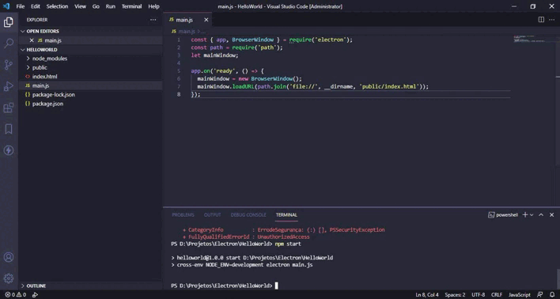

# Simple DashBoard app compiling on Electron



[](https://www.npmjs.com/package/n) [](https://www.npmjs.com/package/n) [](https://www.npmjs.com/package/n) 

## *OBJECTIVE :*
The project aims to make a simple compilation of an html dashboard also very simple

## *INSTALLING :*

```sh
git clone https://github.com/danilosoftwares/DashBoardSimplesElectron.git
cd DashBoardSimplesElectron
yarn install
```

## *BUILDING :*

```sh
yarn electron-builder -w   
```

## *DEBUG :*

```sh
yarn electron-builder -w   
```
## License

MIT

